# homework12
SELinux

1.  Запустить nginx на нестандартном порту 3-мя разными способами:
      * переключатели setsebool;
      * добавление нестандартного порта в имеющийся тип;
      * формирование и установка модуля SELinux.
 ```   
-Запускаем ВМ по предоставленному Vagrantfile, с установкой и запуском nginx
	При установки ВМ, запуск nginx завершится ошибкой, т.к. nginx использует не стандартный порт, который запрещен SELinux для nginx.
-Входим в ВМ как su и проверяем отключен ли firewalld:
  
        [root@selinux ~]# systemctl status firewalld
        ● firewalld.service - firewalld - dynamic firewall daemon
           Loaded: loaded (/usr/lib/systemd/system/firewalld.service; disabled; vendor preset: enabled)
           Active: inactive (dead)
             Docs: man:firewalld(1)
```
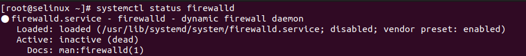
```
-Проверяем корректность настройки nginx:
        [root@selinux ~]# nginx -t
        nginx: the configuration file /etc/nginx/nginx.conf syntax is ok
        nginx: configuration file /etc/nginx/nginx.conf test is successful
-Проверяем уровень безопасности SELinux:
        [root@selinux ~]# getenforce
        Enforcing
```
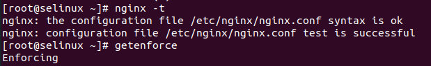
```
1.1 Разрешим в SELinux работу nginx на порту TCP 4881 c помощью переключателей setsebool
    - Находим в логах (/var/log/audit/audit.log) информацию о времени блокировании порта
        [root@selinux ~]# cat /var/log/audit/audit.log | grep 4881 
        type=AVC msg=audit(1707486334.233:819): avc:  denied  { name_bind } for  pid=2891 comm="nginx" src=4881 scontext=system_u:system_r:httpd_t:s0 tcontext=system_u:object_r:unreserved_port_t:s0 tclass=tcp_socket permissive=0
```
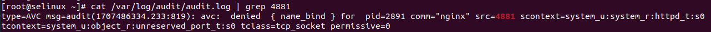
```
    - Копируем время, в которое был записан этот лог, и, с помощью утилиты audit2why смотрим информации о запрете: 
        [root@selinux ~]# grep 1707486334.233:819 /var/log/audit/audit.log | audit2why
        type=AVC msg=audit(1707486334.233:819): avc:  denied  { name_bind } for  pid=2891 comm="nginx" src=4881 scontext=system_u:system_r:httpd_t:s0 tcontext=system_u:object_r:unreserved_port_t:s0 tclass=tcp_socket permissive=0
	        Was caused by:
	        The boolean nis_enabled was set incorrectly. 
	        Description:
	        Allow nis to enabled

	        Allow access by executing:
	        # setsebool -P nis_enabled 1
```
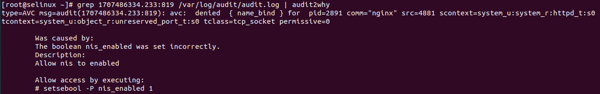
```
      Утилита audit2why покажет почему трафик блокируется. Исходя из вывода утилиты, мы видим, что нам нужно поменять параметр nis_enabled.
    - Включим параметр nis_enabled и перезапустим nginx: 
        setsebool -P nis_enabled on        
        systemctl restart nginx
        systemctl status nginx
 ```
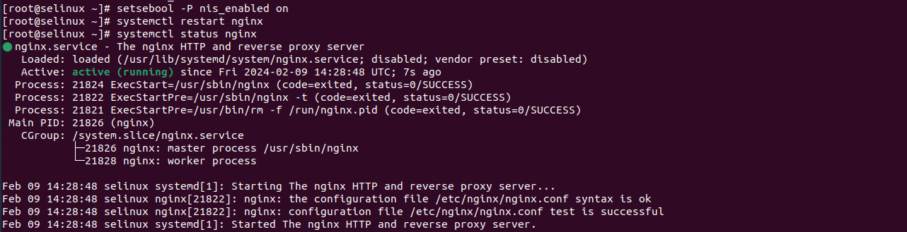
```
      Также можно проверить работу nginx из браузера. Заходим в любой браузер на хосте и переходим по адресу http://127.0.0.1:4881
```

```
    - Проверить статус параметра можно с помощью команды: 
        [root@selinux ~]# getsebool -a | grep nis_enabled
        nis_enabled --> on
```
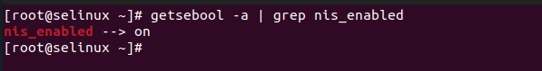
```
    - Вернём запрет работы nginx на порту 4881 обратно. Для этого отключим nis_enabled: 
        [root@selinux ~]# setsebool -P nis_enabled off
        [root@selinux ~]# getsebool -a | grep nis_enabled
        nis_enabled --> off
```

```
    - После отключения nis_enabled служба nginx снова не запустится.   
```
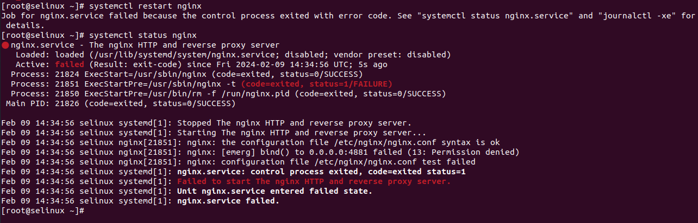
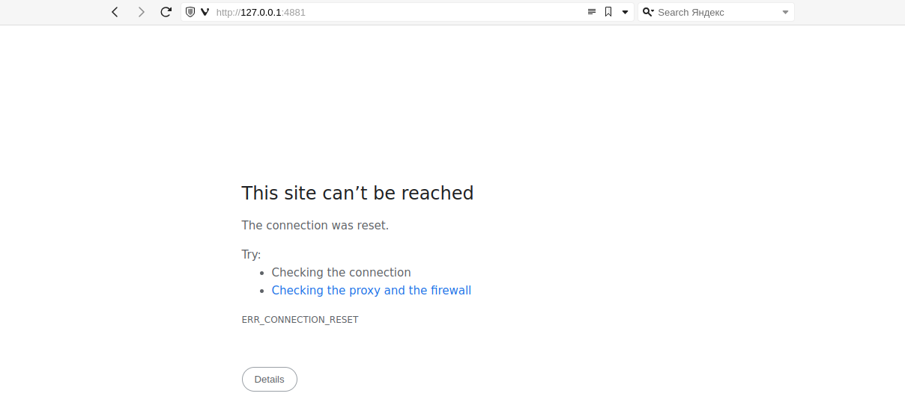
```
1.2 Теперь разрешим в SELinux работу nginx на порту TCP 4881 c помощью добавления нестандартного порта в имеющийся тип:
    - Поиск имеющегося типа, для http трафика: 
        [root@selinux ~]# semanage port -l | grep http
        http_cache_port_t              tcp      8080, 8118, 8123, 10001-10010
        http_cache_port_t              udp      3130
        http_port_t                    tcp      80, 81, 443, 488, 8008, 8009, 8443, 9000
        pegasus_http_port_t            tcp      5988
        pegasus_https_port_t           tcp      5989
```
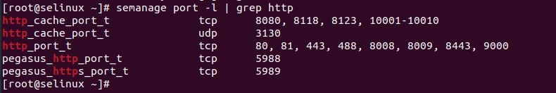
```
    - Добавим порт в тип http_port_t: 
        semanage port -a -t http_port_t -p tcp 4881 
    - Теперь перезапустим службу nginx и проверим её работу:
        [root@selinux ~]# systemctl restart nginx
        [root@selinux ~]# systemctl status nginx
        ● nginx.service - The nginx HTTP and reverse proxy server
           Loaded: loaded (/usr/lib/systemd/system/nginx.service; disabled; vendor preset: disabled)
           Active: active (running) since Fri 2024-02-09 14:41:31 UTC; 11s ago
          Process: 21879 ExecStart=/usr/sbin/nginx (code=exited, status=0/SUCCESS)
          Process: 21877 ExecStartPre=/usr/sbin/nginx -t (code=exited, status=0/SUCCESS)
          Process: 21876 ExecStartPre=/usr/bin/rm -f /run/nginx.pid (code=exited, status=0/SUCCESS)
         Main PID: 21881 (nginx)
           CGroup: /system.slice/nginx.service
                   ├─21881 nginx: master process /usr/sbin/nginx
                   └─21883 nginx: worker process

        Feb 09 14:41:31 selinux systemd[1]: Starting The nginx HTTP and reverse proxy server...
        Feb 09 14:41:31 selinux nginx[21877]: nginx: the configuration file /etc/nginx/nginx.conf syntax is ok
        Feb 09 14:41:31 selinux nginx[21877]: nginx: configuration file /etc/nginx/nginx.conf test is successful
        Feb 09 14:41:31 selinux systemd[1]: Started The nginx HTTP and reverse proxy server.
```
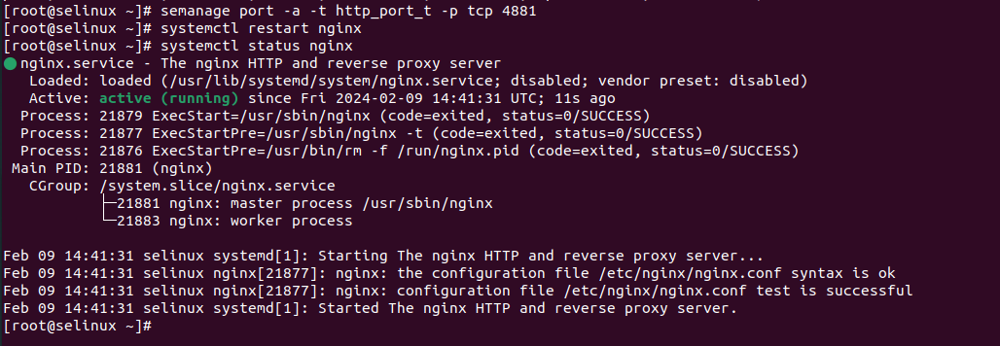
```
      Также можно проверить работу nginx из браузера. Заходим в любой браузер на хосте и переходим по адресу http://127.0.0.1:4881   
    - Удалить нестандартный порт из имеющегося типа можно с помощью команды:
        [root@selinux ~]# semanage port -d -t  http_port_t -p tcp 4881
        [root@selinux ~]# systemctl restart nginx
        Job for nginx.service failed because the control process exited with error code. See "systemctl status nginx.service" and "journalctl -xe" for details.
        [root@selinux ~]# systemctl status nginx
        ● nginx.service - The nginx HTTP and reverse proxy server
           Loaded: loaded (/usr/lib/systemd/system/nginx.service; disabled; vendor preset: disabled)
           Active: failed (Result: exit-code) since Fri 2024-02-09 14:44:27 UTC; 3s ago
          Process: 21879 ExecStart=/usr/sbin/nginx (code=exited, status=0/SUCCESS)
          Process: 21903 ExecStartPre=/usr/sbin/nginx -t (code=exited, status=1/FAILURE)
          Process: 21902 ExecStartPre=/usr/bin/rm -f /run/nginx.pid (code=exited, status=0/SUCCESS)
         Main PID: 21881 (code=exited, status=0/SUCCESS)

        Feb 09 14:44:27 selinux systemd[1]: Stopped The nginx HTTP and reverse proxy server.
        Feb 09 14:44:27 selinux systemd[1]: Starting The nginx HTTP and reverse proxy server...
        Feb 09 14:44:27 selinux systemd[1]: nginx.service: control process exited, code=exited status=1
        Feb 09 14:44:27 selinux nginx[21903]: nginx: the configuration file /etc/nginx/nginx.conf syntax is ok
        Feb 09 14:44:27 selinux nginx[21903]: nginx: [emerg] bind() to 0.0.0.0:4881 failed (13: Permission denied)
        Feb 09 14:44:27 selinux nginx[21903]: nginx: configuration file /etc/nginx/nginx.conf test failed
        Feb 09 14:44:27 selinux systemd[1]: Failed to start The nginx HTTP and reverse proxy server.
        Feb 09 14:44:27 selinux systemd[1]: Unit nginx.service entered failed state.
        Feb 09 14:44:27 selinux systemd[1]: nginx.service failed.
            
1.3 Разрешим в SELinux работу nginx на порту TCP 4881 c помощью формирования и установки модуля SELinux:   
    - Попробуем снова запустить nginx:
        [root@selinux ~]# systemctl start nginx
        Job for nginx.service failed because the control process exited with error code. See "systemctl status nginx.service" and "journalctl -xe" for details.
      Nginx не запуститься, так как SELinux продолжает его блокировать. 
    - Посмотрим логи SELinux, которые относятся к nginx:
        [root@selinux ~]# grep nginx /var/log/audit/audit.log
        type=SOFTWARE_UPDATE msg=audit(1707486333.696:817): pid=2764 uid=0 auid=1000 ses=2 subj=unconfined_u:unconfined_r:unconfined_t:s0-s0:c0.c1023 msg='sw="nginx-filesystem-1:1.20.1-10.el7.noarch" sw_type=rpm key_enforce=0 gpg_res=1 root_dir="/" comm="yum" exe="/usr/bin/python2.7" hostname=? addr=? terminal=? res=success'
        type=SOFTWARE_UPDATE msg=audit(1707486333.971:818): pid=2764 uid=0 auid=1000 ses=2 subj=unconfined_u:unconfined_r:unconfined_t:s0-s0:c0.c1023 msg='sw="nginx-1:1.20.1-10.el7.x86_64" sw_type=rpm key_enforce=0 gpg_res=1 root_dir="/" comm="yum" exe="/usr/bin/python2.7" hostname=? addr=? terminal=? res=success'
        type=AVC msg=audit(1707486334.233:819): avc:  denied  { name_bind } for  pid=2891 comm="nginx" src=4881 scontext=system_u:system_r:httpd_t:s0 tcontext=system_u:object_r:unreserved_port_t:s0 tclass=tcp_socket permissive=0
        type=SYSCALL msg=audit(1707486334.233:819): arch=c000003e syscall=49 success=no exit=-13 a0=6 a1=55b6ee1438b8 a2=10 a3=7fff1c1a25b0 items=0 ppid=1 pid=2891 auid=4294967295 uid=0 gid=0 euid=0 suid=0 fsuid=0 egid=0 sgid=0 fsgid=0 tty=(none) ses=4294967295 comm="nginx" exe="/usr/sbin/nginx" subj=system_u:system_r:httpd_t:s0 key=(null)
        type=SERVICE_START msg=audit(1707486334.243:820): pid=1 uid=0 auid=4294967295 ses=4294967295 subj=system_u:system_r:init_t:s0 msg='unit=nginx comm="systemd" exe="/usr/lib/systemd/systemd" hostname=? addr=? terminal=? res=failed'
        type=SERVICE_START msg=audit(1707488928.801:870): pid=1 uid=0 auid=4294967295 ses=4294967295 subj=system_u:system_r:init_t:s0 msg='unit=nginx comm="systemd" exe="/usr/lib/systemd/systemd" hostname=? addr=? terminal=? res=success'
        type=SERVICE_STOP msg=audit(1707489296.095:875): pid=1 uid=0 auid=4294967295 ses=4294967295 subj=system_u:system_r:init_t:s0 msg='unit=nginx comm="systemd" exe="/usr/lib/systemd/systemd" hostname=? addr=? terminal=? res=success'
        type=AVC msg=audit(1707489296.130:876): avc:  denied  { name_bind } for  pid=21851 comm="nginx" src=4881 scontext=system_u:system_r:httpd_t:s0 tcontext=system_u:object_r:unreserved_port_t:s0 tclass=tcp_socket permissive=0
        type=SYSCALL msg=audit(1707489296.130:876): arch=c000003e syscall=49 success=no exit=-13 a0=6 a1=555cc80368b8 a2=10 a3=7ffdcab718a0 items=0 ppid=1 pid=21851 auid=4294967295 uid=0 gid=0 euid=0 suid=0 fsuid=0 egid=0 sgid=0 fsgid=0 tty=(none) ses=4294967295 comm="nginx" exe="/usr/sbin/nginx" subj=system_u:system_r:httpd_t:s0 key=(null)
        type=SERVICE_START msg=audit(1707489296.130:877): pid=1 uid=0 auid=4294967295 ses=4294967295 subj=system_u:system_r:init_t:s0 msg='unit=nginx comm="systemd" exe="/usr/lib/systemd/systemd" hostname=? addr=? terminal=? res=failed'
        type=SERVICE_START msg=audit(1707489691.946:881): pid=1 uid=0 auid=4294967295 ses=4294967295 subj=system_u:system_r:init_t:s0 msg='unit=nginx comm="systemd" exe="/usr/lib/systemd/systemd" hostname=? addr=? terminal=? res=success'
        type=SERVICE_STOP msg=audit(1707489867.727:885): pid=1 uid=0 auid=4294967295 ses=4294967295 subj=system_u:system_r:init_t:s0 msg='unit=nginx comm="systemd" exe="/usr/lib/systemd/systemd" hostname=? addr=? terminal=? res=success'
        type=AVC msg=audit(1707489867.762:886): avc:  denied  { name_bind } for  pid=21903 comm="nginx" src=4881 scontext=system_u:system_r:httpd_t:s0 tcontext=system_u:object_r:unreserved_port_t:s0 tclass=tcp_socket permissive=0
        type=SYSCALL msg=audit(1707489867.762:886): arch=c000003e syscall=49 success=no exit=-13 a0=6 a1=55c659ef88b8 a2=10 a3=7fffeba836a0 items=0 ppid=1 pid=21903 auid=4294967295 uid=0 gid=0 euid=0 suid=0 fsuid=0 egid=0 sgid=0 fsgid=0 tty=(none) ses=4294967295 comm="nginx" exe="/usr/sbin/nginx" subj=system_u:system_r:httpd_t:s0 key=(null)
        type=SERVICE_START msg=audit(1707489867.762:887): pid=1 uid=0 auid=4294967295 ses=4294967295 subj=system_u:system_r:init_t:s0 msg='unit=nginx comm="systemd" exe="/usr/lib/systemd/systemd" hostname=? addr=? terminal=? res=failed'
        type=AVC msg=audit(1707491494.645:895): avc:  denied  { name_bind } for  pid=21937 comm="nginx" src=4881 scontext=system_u:system_r:httpd_t:s0 tcontext=system_u:object_r:unreserved_port_t:s0 tclass=tcp_socket permissive=0
        type=SYSCALL msg=audit(1707491494.645:895): arch=c000003e syscall=49 success=no exit=-13 a0=6 a1=55cb8313a8b8 a2=10 a3=7ffc59bab320 items=0 ppid=1 pid=21937 auid=4294967295 uid=0 gid=0 euid=0 suid=0 fsuid=0 egid=0 sgid=0 fsgid=0 tty=(none) ses=4294967295 comm="nginx" exe="/usr/sbin/nginx" subj=system_u:system_r:httpd_t:s0 key=(null)
        type=SERVICE_START msg=audit(1707491494.645:896): pid=1 uid=0 auid=4294967295 ses=4294967295 subj=system_u:system_r:init_t:s0 msg='unit=nginx comm="systemd" exe="/usr/lib/systemd/systemd" hostname=? addr=? terminal=? res=failed'
```
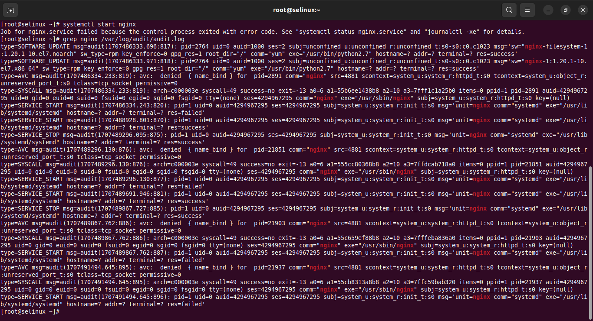
```
    - Воспользуемся утилитой audit2allow для того, чтобы на основе логов SELinux сделать модуль, разрешающий работу nginx на нестандартном порту:
        [root@selinux ~]# grep nginx /var/log/audit/audit.log | audit2allow -M nginx
        ******************** IMPORTANT ***********************
        To make this policy package active, execute:

        semodule -i nginx.pp

    - Audit2allow сформировал модуль, и сообщил нам команду, с помощью которой можно применить данный модуль: 
        [root@selinux ~]# semodule -i nginx.pp
    - Попробуем снова запустить nginx:
        [root@selinux ~]# systemctl start nginx
        [root@selinux ~]# systemctl status nginx
        ● nginx.service - The nginx HTTP and reverse proxy server
           Loaded: loaded (/usr/lib/systemd/system/nginx.service; disabled; vendor preset: disabled)
           Active: active (running) since Fri 2024-02-09 15:27:55 UTC; 6s ago
          Process: 21968 ExecStart=/usr/sbin/nginx (code=exited, status=0/SUCCESS)
          Process: 21966 ExecStartPre=/usr/sbin/nginx -t (code=exited, status=0/SUCCESS)
          Process: 21965 ExecStartPre=/usr/bin/rm -f /run/nginx.pid (code=exited, status=0/SUCCESS)
         Main PID: 21970 (nginx)
           CGroup: /system.slice/nginx.service
                   ├─21970 nginx: master process /usr/sbin/nginx
                   └─21972 nginx: worker process

        Feb 09 15:27:55 selinux systemd[1]: Starting The nginx HTTP and reverse proxy server...
        Feb 09 15:27:55 selinux nginx[21966]: nginx: the configuration file /etc/nginx/nginx.conf syntax is ok
        Feb 09 15:27:55 selinux nginx[21966]: nginx: configuration file /etc/nginx/nginx.conf test is successful
        Feb 09 15:27:55 selinux systemd[1]: Started The nginx HTTP and reverse proxy server.
```

```
      После добавления модуля nginx запустился без ошибок. При использовании модуля изменения сохранятся после перезагрузки.
    - Просмотр всех установленных модулей: 
        [root@selinux ~]# semodule -l
        abrt	1.4.1
        accountsd	1.1.0
        acct	1.6.0
        afs	1.9.0
        aiccu	1.1.0
        aide	1.7.1
        ajaxterm	1.0.0
        alsa	1.12.2
        amanda	1.15.0
        amtu	1.3.0
        anaconda	1.7.0
        antivirus	1.0.0
        ...
        wine	1.11.0
        wireshark	2.4.0
        xen	1.13.0
        xguest	1.2.0
        xserver	3.9.4
        zabbix	1.6.0
        zarafa	1.2.0
        zebra	1.13.0
        zoneminder	1.0.0
        zosremote	1.2.0
    - Для удаления модуля воспользуемся командой: 
        [root@selinux ~]# semodule -r nginx
        libsemanage.semanage_direct_remove_key: Removing last nginx module (no other nginx module exists at another priority).
        [root@selinux ~]# systemctl restart nginx
        Job for nginx.service failed because the control process exited with error code. See "systemctl status nginx.service" and "journalctl -xe" for details.
        [root@selinux ~]# systemctl status nginx
        ● nginx.service - The nginx HTTP and reverse proxy server
           Loaded: loaded (/usr/lib/systemd/system/nginx.service; disabled; vendor preset: disabled)
           Active: failed (Result: exit-code) since Fri 2024-02-09 15:34:45 UTC; 5s ago
          Process: 21968 ExecStart=/usr/sbin/nginx (code=exited, status=0/SUCCESS)
          Process: 22027 ExecStartPre=/usr/sbin/nginx -t (code=exited, status=1/FAILURE)
          Process: 22026 ExecStartPre=/usr/bin/rm -f /run/nginx.pid (code=exited, status=0/SUCCESS)
         Main PID: 21970 (code=exited, status=0/SUCCESS)

        Feb 09 15:34:45 selinux systemd[1]: Starting The nginx HTTP and reverse proxy server...
        Feb 09 15:34:45 selinux systemd[1]: nginx.service: control process exited, code=exited status=1
        Feb 09 15:34:45 selinux nginx[22027]: nginx: the configuration file /etc/nginx/nginx.conf syntax is ok
        Feb 09 15:34:45 selinux nginx[22027]: nginx: [emerg] bind() to 0.0.0.0:4881 failed (13: Permission denied)
        Feb 09 15:34:45 selinux nginx[22027]: nginx: configuration file /etc/nginx/nginx.conf test failed
        Feb 09 15:34:45 selinux systemd[1]: Failed to start The nginx HTTP and reverse proxy server.
        Feb 09 15:34:45 selinux systemd[1]: Unit nginx.service entered failed state.
        Feb 09 15:34:45 selinux systemd[1]: nginx.service failed.
```
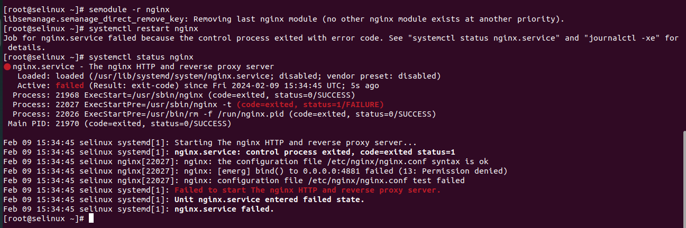
```
